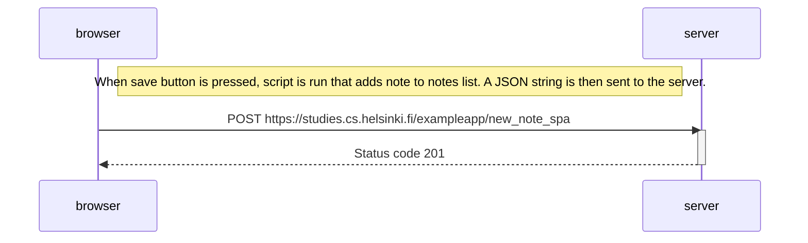

```mermaid
sequenceDiagram
    participant browser
    participant server

    Note right of browser: When save button is pressed, script is run that adds note to notes list. A JSON string is then sent to the server.
    browser->>server: POST https://studies.cs.helsinki.fi/exampleapp/new_note_spa
    activate server
    server-->>browser: Status code 201
    deactivate server

```
